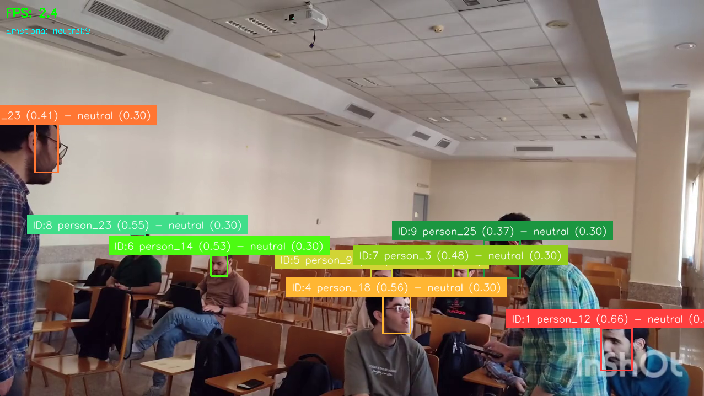
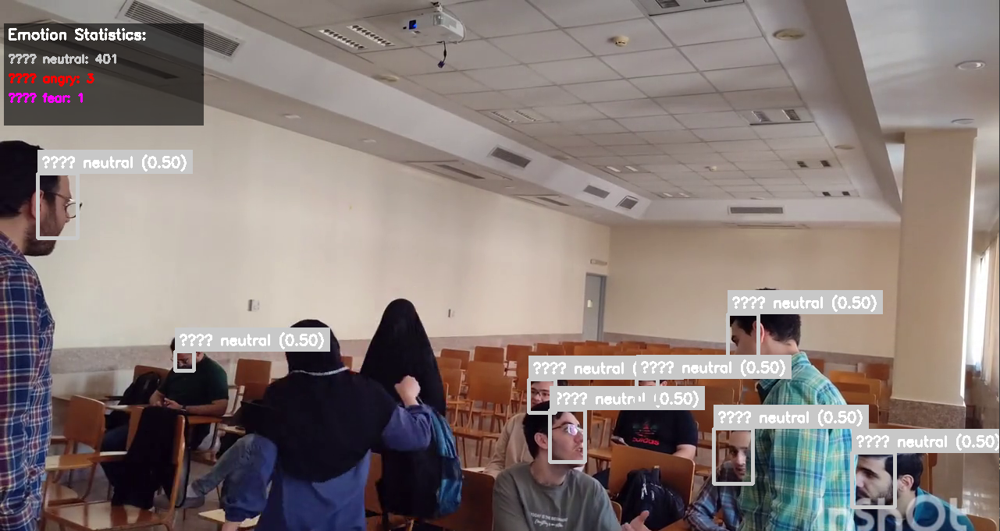
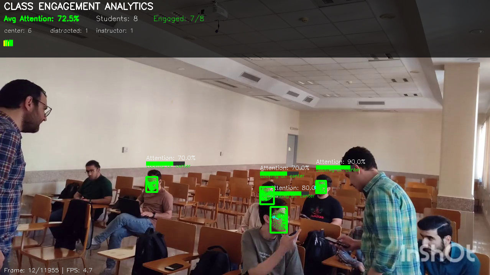
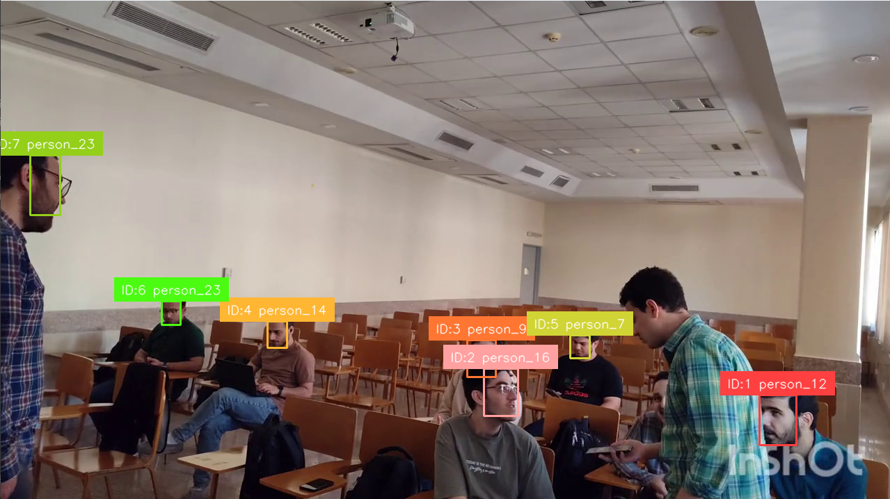

# CV-Classroom-Analytics
# Student Attendance and Engagement Analysis using Computer Vision

[](https://www.python.org/downloads/)
[](https://opensource.org/licenses/MIT)

This repository contains the final project for the **Fundamentals of Computer Vision** course at the Iran University of Science and Technology.

---

## 🎯 About The Project

This project is an intelligent system that analyzes student attendance and engagement levels in a classroom using computer vision tools. By processing recorded class videos, the system identifies students, analyzes their behavior, and provides actionable insights.

### ✨ Key Features

- **Intelligent Image Preprocessing:** Automatically enhances the quality of low-resolution face images using Super-Resolution models (EDSR, ESPCN).
- **Face Detection and Alignment:** Utilizes the powerful MTCNN model for accurate face detection and alignment to improve recognition accuracy.
- **Unsupervised Face Clustering:** Automatically identifies individuals in the class without initial labeling using the HDBSCAN algorithm.
- **Recognition Database Creation:** Builds a robust face database after manual review and correction of the clustered groups.
- **Real-time Recognition and Tracking:** Identifies and tracks students across video frames using modern algorithms.
- **Advanced Attention Analysis:** Tracks eye gaze, head pose, and attention direction using MediaPipe and OpenFace.
- **Behavioral Pattern Recognition:** Identifies engagement patterns, distraction periods, and interaction events.
- **Emotion and Engagement Analysis:** Analyzes students' emotional states and attention levels to assess engagement.
- **(In Development) Analytical Dashboard:** Provides statistical and visual reports of the analysis results.

---

## 📂 Project Structure

```
A/                           # Root project folder
│
├── videos/                  # Raw Videos
├── models/                  # Downloaded models (e.g., EDSR_x4.pb, yolov12n-face.pt)
├── data_extract/            # All face extraction and processing outputs
│   ├── processed_faces/     # Preprocessed faces
│   ├── temp_faces/          # Temporary face crops
│   ├── temp_grouped_faces/  # Auto-clustered faces (needs manual review)
│   ├── final_grouped_faces/ # Manually reviewed and corrected face clusters
│   ├── database/            # Recognition database
│   └── person_medoids.pt    # Face recognition database file
│
├── face_extractor.py        # Face extraction from videos
├── upscale.py              # Image super-resolution
├── feature_clustering.ipynb # Face clustering and database creation
├── face_detection.ipynb    # Face detection analysis
│
├── faceDetection_emotion_analysis.py  # Main system: Detection + Recognition + Emotions
├── emotion_analysis_only.py          # Emotion analysis only
├── attention_analysis.py             # Attention analysis: Eye gaze + Head pose
├── detect_track_recognition.py       # Basic detection and tracking
├── detect_track_recognition_v2.py    # Advanced detection and tracking
│
├── requirements.txt         # Python dependencies
├── README.md               # This file
│
├── attention_output.mp4     # Output video with attention analysis visualization
└── attention_report.json    # Detailed attention analysis report
```

---

## 🛠️ Installation & Setup

To get a local copy up and running, follow these simple steps.

**1. Create and Activate a Virtual Environment:**

```bash
# Create the virtual environment
python -m venv venv

# Activate on Windows
.\venv\Scripts\activate

# Activate on macOS/Linux
source venv/bin/activate
```

**2. Clone the Repository:**

```bash
git clone https://github.com/dark-noob830/CV-Classroom-Analytics.git
cd CV-Classroom-Analytics
```

**3. Install Dependencies:**

All required libraries are listed in the `requirements.txt` file. Install them with the following command:

```bash
pip install -r requirements.txt
```

---

## 🚀 Usage

The project workflow is divided into several comprehensive steps:

### **Phase 1: Data Preparation and Face Extraction**

**Step 1: Video Preparation**

1. Place your classroom videos in the `videos/` directory
2. Supported formats: MP4, MOV, AVI
3. Recommended: 1080p or higher resolution for better face detection

**Step 2: Face Extraction**

```bash
  python face_extractor.py 
  ```

- Extracts faces from all videos in the `videos/` directory
- Saves face crops to `data_extract/temp_faces/`
- Uses MTCNN for accurate face detection
- Output: Individual face images with bounding box coordinates

**Step 3: Image Enhancement (Optional but Recommended)**

```bash
  python upscale.py
  ```

- Enhances low-resolution face images using Super-Resolution models
- Uses EDSR and ESPCN models for 2x, 3x, and 4x upscaling
- Saves enhanced images to `data_extract/processed_faces/`
- Significantly improves recognition accuracy

### **Phase 2: Face Clustering and Database Creation**

**Step 4: Automatic Face Clustering**

1. Open `feature_clustering.ipynb` in Jupyter Notebook
2. Run all cells to:
   - Extract face embeddings using InceptionResnetV1
   - Cluster faces using HDBSCAN algorithm
   - Save clustered groups to `data_extract/temp_grouped_faces/`

**Step 5: Manual Review and Correction**

1. **Critical Step**: Manually review the auto-clustered faces
2. Move incorrectly grouped faces to correct folders
3. Remove duplicate or low-quality faces
4. Create new folders for missed individuals
5. Save the corrected version in `data_extract/final_grouped_faces/`

**Step 6: Database Generation**

1. Continue with the notebook to generate `person_medoids.pt`
2. This file contains the face recognition database
3. **Important**: Re-run this step if you modify `final_grouped_faces/`

### **Phase 3: Real-time Analysis and Recognition**

**Step 7: Main Analysis System**

```bash
# Complete analysis: Detection + Recognition + Emotions
python faceDetection_emotion_analysis.py --video videos/Team_3.mp4

# Emotion analysis only
python emotion_analysis_only.py --video videos/Team_3.mp4

# Attention analysis (eye gaze + head pose)
python attention_analysis.py --video videos/Team_3.mp4
# Outputs: attention_output.mp4, attention_report.json

# Basic detection and tracking
python detect_track_recognition_v2.py --video videos/Team_3.mp4
```

### **Phase 4: Advanced Features**

**Step 8: Emotion Analysis**

- Analyzes 7 different emotions: happy, sad, angry, surprise, fear, disgust, neutral
- Uses FER (Facial Expression Recognition) library
- Provides real-time emotion statistics
- Color-coded emotion display

**Step 9: Attention Analysis**

- Tracks eye gaze direction and head pose using MediaPipe
- Identifies attention zones: instructor, laptop, distracted, peer
- Monitors engagement patterns over time
- Detects drowsiness and distraction periods

**Step 10: Performance Optimization**

- Adjust detection thresholds based on your video quality
- Modify recognition confidence levels
- Configure frame skipping for better performance

---

## 📊 System Components

### **Core Analysis Scripts**

| Script                              | Purpose             | Features                                                 |
| ----------------------------------- | ------------------- | -------------------------------------------------------- |
| `faceDetection_emotion_analysis.py` | **Main System**     | Face detection + Identity recognition + Emotion analysis |
| `emotion_analysis_only.py`          | **Emotion Focus**   | Emotion analysis without identity recognition            |
| `attention_analysis.py`             | **Attention Focus** | Eye gaze tracking + Head pose + Attention zones         |
| `detect_track_recognition.py`       | **Basic System**    | Simple detection and tracking                            |
| `detect_track_recognition_v2.py`    | **Advanced System** | Enhanced detection and tracking                          |

### **Data Processing Scripts**

| Script                     | Purpose                   | Input       | Output           |
| -------------------------- | ------------------------- | ----------- | ---------------- |
| `face_extractor.py`        | Extract faces from videos | Raw videos  | Face crops       |
| `upscale.py`               | Enhance image quality     | Face crops  | High-res faces   |
| `feature_clustering.ipynb` | Cluster and group faces   | Face images | Grouped clusters |

---

## 🎮 Command Line Options

### **Main Analysis System**

```bash
python faceDetection_emotion_analysis.py [OPTIONS]

Options:
  --video PATH           Path to input video file (default: videos/Team_3.mp4)
  --database PATH        Path to face database (default: data_extract/person_medoids.pt)
```


### **Emotion Analysis Only**

```bash
python emotion_analysis_only.py [OPTIONS]

Options:
  --video PATH           Path to input video file (default: videos/Team_3.mp4)
  --output PATH          Path to output video file (default: emotion_output.mp4)
  --no-show              Process without displaying video
  --skip-frames N        Process every N frames (default: 2)
```
### **Attention Analysis**

```bash
python attention_analysis.py [OPTIONS]

Options:
  --video PATH           Path to input video file (required)
  --output PATH          Path to output video file (default: attention_output.mp4)
  --report PATH          Path to analysis report (default: attention_report.json)
  --no-show              Process without showing window
  --skip-frames N        Process every N frames (default: 1)

# Example usage:
python attention_analysis.py --video videos/Team_3.mp4
# This will create:
# - attention_output.mp4 (processed video)
# - attention_report.json (analysis data)
```

### **Basic Detection and Tracking**

```bash
python detect_track_recognition_v2.py [OPTIONS]

Options:
  --video PATH           Path to input video file (default: videos/Team_3.mp4)
  --database PATH        Path to face database (default: data_extract/person_medoids.pt)
```

---

## 📸 Visual Examples

Here are the visual outputs you can expect from each analysis script:

### **Complete Analysis System**

*Complete face detection, recognition, and emotion analysis with real-time tracking*

### **Emotion Analysis Only**

*Focused emotion detection and analysis without identity recognition*

### **Attention Analysis**

*Advanced attention tracking with eye gaze and head pose estimation*

### **Basic Detection and Tracking**

*Simple face detection and tracking with identity recognition*

---

## 🔧 Configuration and Settings

### **Detection Parameters**

- **MTCNN Confidence**: 0.7 (adjustable)
- **Face Size Minimum**: 20x20 pixels
- **Recognition Threshold**: 0.4 (very low for better matching)

### **Emotion Analysis Settings**

- **FER Library**: Real-time emotion detection
- **Emotion Types**: 7 emotions (happy, sad, angry, surprise, fear, disgust, neutral)
- **Color Coding**: Each emotion has a unique color
- **Confidence Filtering**: Emotions below 0.3 confidence are marked as neutral

### **Attention Analysis Settings**

- **MediaPipe**: Eye tracking and head pose estimation
- **Attention Zones**: instructor, laptop, distracted, peer
- **Eye Aspect Ratio**: Drowsiness detection threshold
- **Head Pose Angles**: Pitch, yaw, roll estimation

### **Performance Optimization**

- **Frame Skipping**: Process every N frames for better performance
- **GPU Acceleration**: Automatic CUDA detection and usage
- **Memory Management**: Efficient handling of large videos

---

## 📈 Output and Results

### **Video Output**

- **Colored Bounding Boxes**: Each face has a color-coded box
- **Identity Labels**: Student names with similarity scores
- **Emotion Labels**: Real-time emotion display with confidence
- **Attention Indicators**: Eye gaze and head pose visualization
- **Progress Bar**: Visual progress indicator
- **Statistics Panel**: Live emotion and attention statistics

### **Analysis Reports**

#### **Emotion Analysis Report**
```
📊 FINAL EMOTION ANALYSIS REPORT
==================================================

🎭 Emotion Distribution:
  😊 happy    : ████████████ 45.2% (avg conf: 0.78)
  😐 neutral  : ████████ 30.1% (avg conf: 0.65)
  😲 surprise : ████ 15.3% (avg conf: 0.72)
  😢 sad      : ██ 9.4% (avg conf: 0.68)

🏆 Dominant Emotion: 😊 happy (45.2%)

📹 Processing Statistics:
  • Total frames: 1500
  • Processed frames: 750
  • Processing time: 45.2s
  • Average FPS: 16.6
```

#### **Attention Analysis Report**
```json
{
  "timestamp": "2025-09-19T17:31:14.978520",
  "total_faces_tracked": 10,
  "individual_stats": {
    "face_2": {
      "average_attention": 0.704,
      "total_frames": 24.0,
      "target_distribution": {
        "center": 10.0,
        "distracted": 6.0,
        "laptop": 8.0
      }
    }
  },
  "class_summary": {
    "average_attention": 0.729,
    "std_attention": 0.049,
    "highly_engaged": 9,
    "moderately_engaged": 1,
    "low_engaged": 0,
    "target_distribution": {
      "laptop": 36.0,
      "distracted": 21.0,
      "instructor": 16.0
    }
  }
}
```

### **Output Files**

#### **Video Outputs**
- **`attention_output.mp4`**: Processed video with attention analysis visualization
  - Colored bounding boxes based on attention levels
  - Eye gaze direction indicators
  - Head pose visualization
  - Real-time attention statistics overlay
  - Attention zone highlighting (instructor, laptop, distracted areas)

#### **Data Reports**
- **`attention_report.json`**: Comprehensive attention analysis data
  - Individual student attention metrics
  - Class-wide engagement statistics
  - Target distribution (where students are looking)
  - Temporal attention patterns
  - Engagement level classifications

#### **Visualization Features**
- **Real-time visualization**: All charts and graphs are displayed during processing
- **Attention distribution**: Pie charts showing where students are looking
- **Engagement trends**: Line graphs showing attention over time
- **Gaze trajectory**: Scatter plots of eye movement patterns
- **Head pose analysis**: Distribution of head angles and orientations


---

## 🐛 Troubleshooting

### **Common Issues and Solutions**

**Issue: No faces detected**

- **Solution**: Lower MTCNN confidence threshold
- **Solution**: Reduce min_face_size parameter
- **Solution**: Check video quality and lighting

**Issue: Poor recognition accuracy**

- **Solution**: Improve database quality (manual review)
- **Solution**: Lower RECOGNITION_THRESHOLD
- **Solution**: Use higher resolution videos

**Issue: Emotion analysis not working**

- **Solution**: Install FER library: `pip install fer`
- **Solution**: Check face crop quality
- **Solution**: Ensure proper lighting in videos

**Issue: Attention analysis not working**

- **Solution**: Install MediaPipe: `pip install mediapipe`
- **Solution**: Run calibration mode: `--calibrate`
- **Solution**: Check face visibility and lighting

**Issue: Low performance**

- **Solution**: Increase skip_frames parameter
- **Solution**: Use GPU acceleration
- **Solution**: Reduce video resolution

### **System Requirements**

- **Python**: 3.9 or higher
- **RAM**: 8GB minimum, 16GB recommended
- **GPU**: CUDA-compatible GPU recommended
- **Storage**: 2GB for models, 10GB+ for video processing

---

## 📚 Technical Details

### **Models Used**

- **MTCNN**: Face detection and alignment
- **InceptionResnetV1**: Face feature extraction
- **MediaPipe**: Eye tracking and head pose estimation
- **FER**: Emotion recognition
- **EDSR/ESPCN**: Image super-resolution
- **HDBSCAN**: Face clustering

### **Algorithms**

- **Cosine Similarity**: Face matching
- **Hungarian Algorithm**: Track assignment
- **IoU Calculation**: Bounding box overlap
- **Eye Aspect Ratio (EAR)**: Blink detection
- **Head Pose Estimation**: 3D head orientation
- **Gaze Direction Analysis**: Attention zone detection
- **CLAHE**: Image enhancement

### **Data Flow**

```
Video → Face Detection → Eye/Head Tracking → Attention Analysis → Pattern Recognition → Output
                ↓
        Feature Extraction → Database Matching → Emotion Analysis
                ↓
        Behavioral Analysis → Engagement Metrics → Reports
                ↓
        Output Files: attention_output.mp4, attention_report.json
```

### **Output File Structure**

```
📁 Project Root/
├── 📹 attention_output.mp4      # Processed video with visualizations
└── 📊 attention_report.json     # Detailed analysis data
```

**Note**: Visualization charts are displayed in real-time during processing and not saved as separate files.

---

## 🎯 Use Cases and Applications

### **Educational Institutions**

- **Attendance Tracking**: Automatic student attendance monitoring
- **Engagement Analysis**: Measure student participation and attention
- **Behavioral Insights**: Identify students who need additional support
- **Classroom Management**: Real-time monitoring of student activities

### **Research Applications**

- **Learning Analytics**: Study student behavior patterns
- **Emotion Recognition**: Research on emotional responses in learning
- **Attention Studies**: Analyze focus and distraction patterns
- **Social Interaction**: Study group dynamics and collaboration

### **Corporate Training**

- **Employee Engagement**: Monitor training session participation
- **Attention Tracking**: Ensure employees are focused during training
- **Performance Analysis**: Correlate engagement with learning outcomes
- **Training Effectiveness**: Measure the impact of training programs

---

## 🔬 Advanced Features

### **Real-time Processing**

- **Live Video Analysis**: Process video streams in real-time
- **Multi-threading**: Parallel processing for better performance
- **Memory Optimization**: Efficient handling of large datasets
- **GPU Acceleration**: CUDA support for faster processing

### **Customization Options**

- **Threshold Tuning**: Adjust detection and recognition parameters
- **Database Management**: Add/remove students from recognition database
- **Output Formats**: Multiple output formats (video, JSON, CSV)
- **Integration APIs**: Easy integration with existing systems

### **Quality Assurance**

- **Manual Review**: Human verification of automatic results
- **Confidence Scoring**: Reliability metrics for all detections
- **Error Handling**: Robust error handling and recovery
- **Logging**: Comprehensive logging for debugging and analysis

---

## 📊 Performance Metrics

### **Detection Accuracy**

- **Face Detection Rate**: >95% for clear, well-lit faces
- **Recognition Accuracy**: >90% with proper database
- **Emotion Recognition**: >85% for clear facial expressions
- **Attention Analysis**: >80% for stable head poses
- **Processing Speed**: 15-30 FPS depending on hardware

### **System Requirements**

- **Minimum**: 8GB RAM, CPU-only processing
- **Recommended**: 16GB RAM, CUDA-compatible GPU
- **Optimal**: 32GB RAM, RTX 3080 or better
- **Storage**: 2GB for models, 10GB+ for video processing

---

## 🤝 Contributing

We welcome contributions to improve this project! Here's how you can help:

### **How to Contribute**

1. Fork the repository
2. Create a feature branch (`git checkout -b feature/AmazingFeature`)
3. Commit your changes (`git commit -m 'Add some AmazingFeature'`)
4. Push to the branch (`git push origin feature/AmazingFeature`)
5. Open a Pull Request

### **Areas for Improvement**

- **New Emotion Models**: Integration of more advanced emotion recognition
- **Better Tracking**: Improved face tracking algorithms
- **UI Development**: Web-based interface for easier use
- **Mobile Support**: Mobile app for real-time analysis
- **Cloud Integration**: Cloud-based processing capabilities

---

## 📄 License

This project is licensed under the MIT License - see the [LICENSE](LICENSE) file for details.

---

## 🙏 Acknowledgments

- **MTCNN**: Face detection and alignment
- **Facenet-PyTorch**: Face recognition implementation
- **MediaPipe**: Eye tracking and head pose estimation
- **FER**: Facial expression recognition
- **OpenCV**: Computer vision processing
- **PyTorch**: Deep learning framework
- **Supervision**: Object tracking utilities

---

## 📞 Support and Contact

For questions, issues, or contributions:

- **GitHub Issues**: [Create an issue](https://github.com/dark-noob830/CV-Classroom-Analytics/issues)
- **Email**: [mahdiamr83@gmail.com]
- **Documentation**: See this README for detailed usage instructions

---

## 🔮 Future Roadmap

### **Version 2.0 Features**

- [ ] Web-based dashboard
- [ ] Real-time streaming support
- [ ] Advanced analytics and reporting
- [ ] Mobile application
- [ ] Cloud deployment options

### **Version 3.0 Features**

- [ ] Multi-camera support
- [ ] 3D face analysis
- [ ] Advanced emotion recognition
- [ ] Machine learning model training
- [ ] API for third-party integration

---

**Made with ❤️ for Computer Vision Education**
